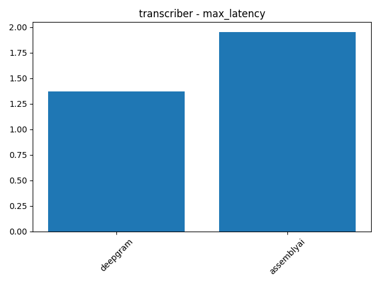
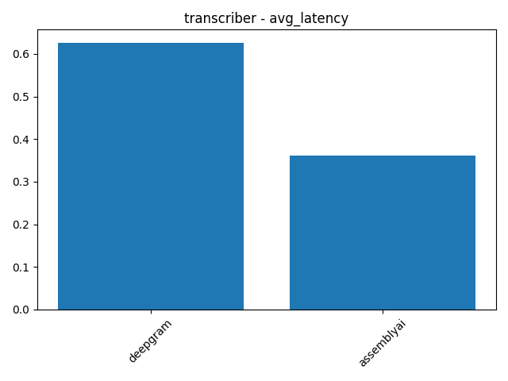
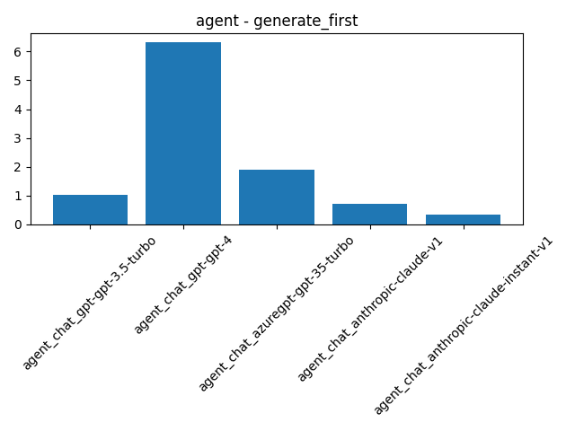
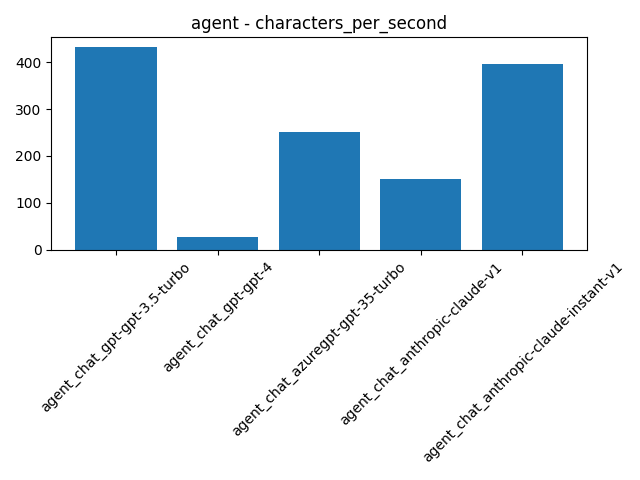
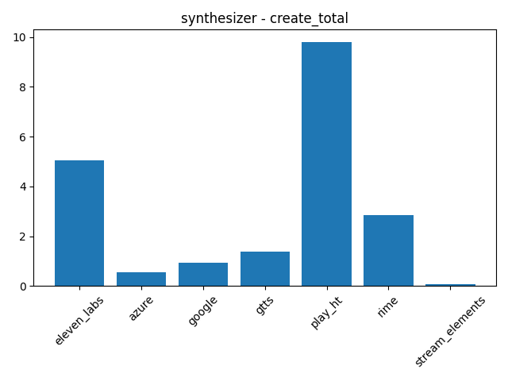
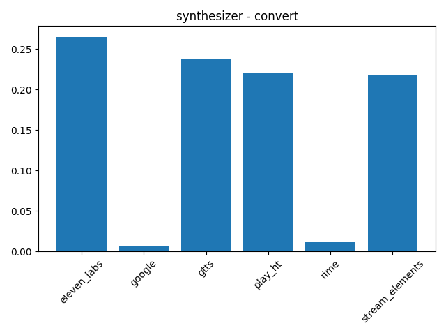

Voice-based LLM applications are becoming more popular and powerful, enabling users to interact with natural language models using speech. However, building and evaluating such applications can be challenging, as they involve multiple components such as speech recognition, natural language understanding, natural language generation, and speech synthesis. Each of these components has its own performance metrics and trade-offs, such as latency, accuracy, quality, and cost.

To help developers and researchers benchmark voice-based LLM applications, we have created a simple yet powerful script that can measure the latency and throughput of various speech-to-text, text-to-speech, and natural language generation providers. The script is available at [playground/streaming/benchmark.py](https://github.com/vocodedev/vocode-python/blob/main/playground/streaming/benchmark.py) in the [vocode-python](https://github.com/vocodedev/vocode-python) repo. If you find this script useful, please consider starring the repo to show your support.

The script uses [Vocode](https://vocode.dev), an open-source library for building voice-based LLM applications. Vocode provides tools and abstractions to build any kind of voice-based application on top of LLMs. Examples of things you can build with Vocode include setting up LLMs to answer/make phone calls, act as personal assistants, join Zoom meetings, and more. Vocode also integrates with all of the best speech-to-text, text-to-speech, and LLM providers like Deepgram, AssemblyAI, ElevenLabs, PlayHT, Azure, Google, Anthropic, and OpenAI.

In this blog post, we will share our results and insights regarding the latencies of the various providers supported by Vocode.

## Transcribers

Transcribers are responsible for converting speech to text. They are essential for voice-based LLM applications, as they enable the natural language models to understand the user's input.

To measure the latency of streaming speech-to-text systems, we use a method inspired by [Deepgram](https://developers.deepgram.com/docs/measuring-streaming-latency). The streaming transcription latency is the difference between the amount of audio submitted and the amount of audio transcribed. We compute this by maintaining an audio cursor (the number of seconds of audio submitted) and a transcript cursor (the amount of audio transcribed) and computing the difference between them each time we get a response from the speech-to-text API. The maximum latency is computed as soon as a response is received before updating the transcript cursor. Then, the transcript cursor is updated to account for the new transcript received and the minimum latency is calculated. The average latency is the mean of these two measurements weighted by the duration of the audio transcribed. These average latency values are then summed and divided by the total audio length to determine the average latency reported in the table below.

The audio we submit is the first 10 seconds of [Deepgram's sample WAV file](https://res.cloudinary.com/deepgram/video/upload/v1681921235/devex/interview_speech-analytics_phntpw.wav). Our sample is available [here in our repo](https://github.com/vocodedev/vocode-python/raw/e779b04095a377adac1bba449bc2de115e44c2e3/playground/streaming/test.wav).

While Vocode supports many speech-to-text providers, we only benchmarked Deeepgram and AssemblyAI since they return the measurements needed to accurately compute streaming latency.

Our results are as follows:

| Transcriber | Minimum Latency | Maximum Latency | Average Latency |
|-------------|-----------------|-----------------|-----------------|
| Deepgram | 0 | 1.37 | 0.63 |
| AssemblyAI | 0 | 1.95 | 0.36 |

|||
|-|-|
|||

Both Deepgram and AssemblyAI have very low latency, with AssemblyAI having a ≈43% lower average latency than Deepgram. AssemblyAI does have a half-second greater maximum latency, which means it may take slightly longer than Deepgram at worst. However, latency is not the only factor to consider when choosing a transcriber. Accuracy and cost are also important, and they may vary depending on the type and quality of the audio input, the language and dialect of the speaker, the background noise, and the domain of the speech. Therefore, we recommend testing different transcribers on your own data and use cases to find the best fit for your voice-based LLM application.

## Agents

Agents are responsible for generating natural language responses based on the user's input. They are the core of voice-based LLM applications. Agents can vary in their latency and quality of responses.

To measure the latency of natural language generation systems, we use a simple method that involves sending a text input to the natural language generation API and measuring two latencies:

- Generate First: the time it takes for the first response to come back from the API
- Generate Total: the time it takes for the agent to complete its response

We also compute the characters per second by keeping track of the total number of characters generated across the 5 runs and dividing that by the total time taken to generate all the responses.

To test these agents, we use the preamble/system message "The AI is having a very long conversation about life" with the prompt "Write 1000 words about the meaning of life". We want the agent to generate many sentences so the the initial response time does not greatly impact the characters per second.

Our results are as follows:

| Agent              | Generate First (s) | Generate Total (s) | Characters per Second |
|--------------------|--------------------|--------------------|-----------------------|
| gpt-3.5-turbo      | 1.02               | 8.86               | 431.20                |
| gpt-4              | 6.31               | 121.53             | 26.59                 |
| azuregpt-3.5-turbo | 1.90               | 10.71              | 250.40                |
| claude-v1          | 0.70               | 6.42               | 150.87                |
| claude-instant-v1  | 0.33               | 2.46               | 395.11                |

|||
|-|-|
|||

Claude Instant and GPT 3.5 Turbo are similar in terms of speed, with Claude Instant being slightly faster in its initial response but GPT 3.5 Turbo being about 9% faster by characters per second. GPT 3.5 Turbo is overall about 16x faster than GPT 4. AzureGPT 3.5 Turbo is 58% as fast as OpenAI's GPT 3.5 Turbo and has almost 2x the initial response time. Claude v1 is the second fastest agent at returning its first response, but it is the second slowest in characters per second.

Overall, OpenAI's GPT 3.5 Turbo is an overall great choice: It is the fastest agent in terms of characters per second and is reasonly fast at returning its first response. However, if you need an initial response as fast as possible, then Claude Instant is the best choice.

It is also important to consider quality when choosing an agent. Claude Instant and GPT 3.5 may be fast, but GPT-4 is sure to provide more intelligent answers. Therefore, we recommend testing different agents on your own data and use cases to find the best fit for your voice-based LLM application.

## Synthesizers

Synthesizers are responsible for converting text to speech. Synthesizers enable the agent to speak to the user.

To measure the latency of text-to-speech systems, we use a method that involves sending a text input to the text-to-speech API and measuring the time it takes to receive an audio output. We measure two latencies for each synthesizer:

- Synthesis Time: the time it takes to synthesize the text
- Conversion Time: the time it takes to decompress the audio into the wave format

The synthesized speech is converted to a wave because the output devices Vocode supports (such as a speaker and a phone call via Twilio) require decompressed raw audio. Synthesis is usually performed by sending an HTTP POST request to the relevant synthesis API. We measure the time it takes to get an audio file response from this POST request as the synthesis time and measure the rest of the processing as the conversion time. An exception to this strategy is Azure. Azure is capable of streaming synthesis results. This means chunks of synthesized speech are sent as soon as they are ready instead of synthesizing the entire text at once and only returning the result when all the text is synthesized. Thus, for Azure we measure the total synthesis time and the time to return the first chunk of audio from our HTTP request.

We synthesize the first sentence of Alice in Wonderland: Alice was beginning to get very tired of sitting by her sister on the bank, and of having nothing to do: once or twice she had peeped into the book her sister was reading, but it had no pictures or conversations in it, “and what is the use of a book,” thought Alice “without pictures or conversations?”

Our results are as follows:

| Synthesizer | Synthesis Time (s) | Conversion Time (s) | Total Time (s) |
|-----------------|--------------------|---------------------|----------------|
| ElevenLabs | 5.04 | 0.26 | 5.31 |
| Azure | 0.54 | N/A | 0.54 |
| Google | 0.93 | 0.01 | 0.93 |
| GTTS | 1.40 | 0.24 | 1.63 |
| PlayHT | 9.81 | 0.22 | 10.03 |
| Rime | 2.84 | 0.01 | 2.85 |
| Stream Elements | 0.09 | 0.22 | 0.31 |

|||
|-|-|
|||

Stream Elements is by far the fastest synthesizer: It synthesized the test sentence 6x faster than Azure, the second fastest synthesizer. If conversion time is taken into account, StreamElements is still the fastest, but only 1.7x faster than Azure. StreamElements is also completely free! Compared to GTTS, another free synthesizer, StreamElements is faster and higher quality. Azure provides an excellent trade off between quality and latency. Azure's samples sound natural and realistic while still being more than 9x faster than ElevenLabs, 18x faster than PlayHT, and only about 1/5 a second slower than StreamElements. If you want the best quality and latency isn't a big concern, then ElevenLabs is definitely the best choice. Rime can synthesize about twice as fast ElevenLabs and sounds decent. It is up to you to determine if the quality-latency tradeoff makes Rime a better choice than ElevenLabs.

## Conclusion

We benchmarked different providers for each component of voice-based LLM applications that you can build using Vocode. We hope that these results and this script will help you find the best providers for your voice-based LLM application in order to optimize its performance and quality. You can use this script to compare different providers, test different settings, and experiment with different inputs and outputs.

If you have any questions, feedback, or suggestions, don't hesitate to reach out to us on [our discord](https://discord.gg/NaU4mMgcnC). We would love to hear from you and learn from your experience.

Thank you for reading and happy benchmarking! 🎙️

## Reproducibility

Replicating our results is relatively simple. Clone the [vocode-python](https://github.com/vocodedev/vocode-python) repo, install the dependencies with `poetry install --extras all`, and run the following commands:

- Transcribers: `python playground/streaming/benchmark.py --transcribers deepgram assemblyai --transcriber_num_cycles 5 --create_graphs`
- Agents: `python playground/streaming/benchmark.py --agents all --agent_num_cycles 5 --agent_prompt_preamble "The AI is having a very long conversation about life" --agent_first_input "Write 1000 words about the meaning of life" --create_graphs`
- Synthesizers: `python playground/streaming/benchmark.py --synthesizers elevenlabs azure google gtts playht rime streamelements --synthesizer_num_cycles 5 --create_graphs`

You can see more details about the script and its options by running `python playground/streaming/benchmark.py --help` or viewing [the documentation](https://docs.vocode.dev/tracing#benchmarking-script). If you have any questions or issues, feel free to ask us [on discord](https://discord.gg/NaU4mMgcnC) or [open an issue on GitHub](https://github.com/vocodedev/vocode-python/issues).

Please star [our repo](https://github.com/vocodedev/vocode-python) if you find this script useful. Thank you!